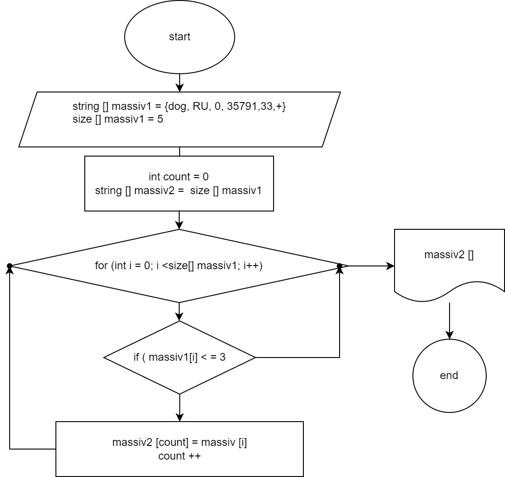

# Контрольная работа по основному блоку
## Контрольная работа состояла из нескольких этапов
1. Составить блок - схему для написания программы 
2. Описать алгоритм решения 
3. Написать программу, для решения данной задачи
4. Создать репозиторий на GitHub 
   ## *ЗАДАЧА*:
   Написать программу, которая из имеющегося массива строк формирует новый массив из строк, длина которых меньше, либо равна 3 символам. Первоначальный массив можно ввести с клавиатуры, либо задать на старте выполнения алгоритма. 
### *Алгоритм написания программы*
 Объявляем первый массив (massiv1),  в нем указываем данные принятые от пользователя – размер массива и элемент массива
Объявляем второй массив (massiv2), выделяем ля него памяти в соответствии с размером первого массива (massiv1).
Исходя из условия задачи указываем цикл for, так как у нас есть точные границы (размер массива), цикл будет повторяться, пока не пройдет по всему первому массиву (massiv1). В Цикле указываем условия задачи , если элементы меньше указанного количества, то эти элементы записываются в новый массив (massiv2). По окончанию чикла выводим (massiv2)

